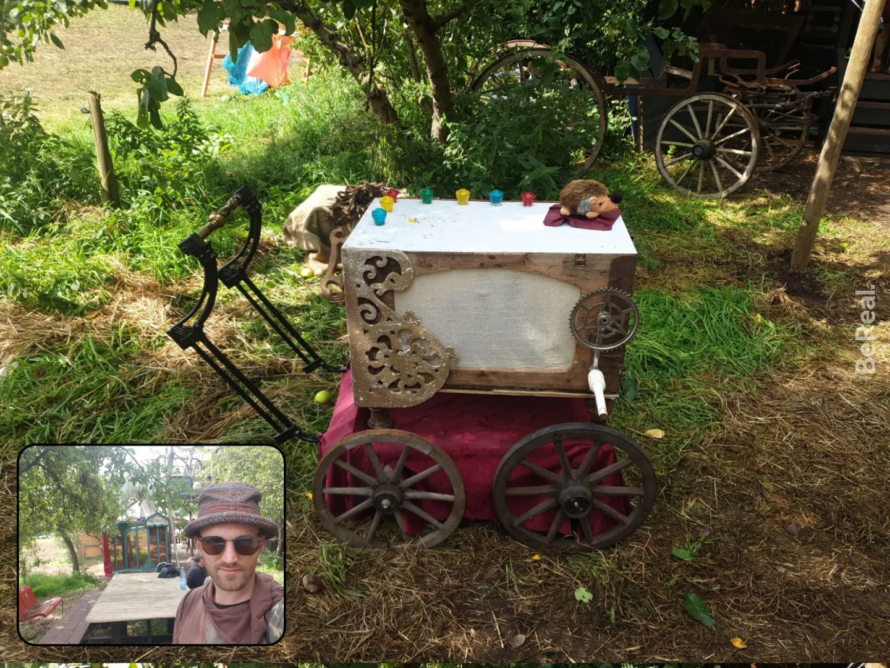

# Digital Leierkasten (electronic barrel)

This is the code for a digital electronic barrel, made for the Moyn Festival 2023. It consists of to parts:  

* An Arduino Nano with a button (the hedgehog) that plays the next song, as well as a rotary encoder connected to a crank which encodes the turning speed and translates it to a playback frequency, which is connected over USB to
* A Raspberry Pi, that receives the turning speed of the crank and plays a song in varyings speeds, relying on `mplayer`.



## 3D-Files

* Rotary Crank Mount: https://www.thingiverse.com/thing:6315711
* Dipswitch-Mount: https://www.thingiverse.com/thing:6315663
* Cherryswitch-Mount: https://www.thingiverse.com/thing:6315641


## Install

### Arduino-Code

... relies on PlatformIO and micromouseonline's BasicEncoder-library

### Raspberry Pi Python Code

We want to use mplayer, which can regularly update the playback speed: https://unix.stackexchange.com/a/578168/441563. For that, we just use the Anki sound-library that did it: https://raw.githubusercontent.com/ankitects/anki/484377b8091179504b21b29be1de6925c70af4bd/qt/aqt/sound.py. Sooo for that we need PortAudio: https://askubuntu.com/a/1090345

See for anki:  
* https://github.com/ankitects/anki  
* https://github.com/ankitects/anki/blob/main/docs/linux.md

```
sudo apt install mplayer -y
pip install -r requirements.txt
```

#### Transfer Code to Pi:

```
rsync -az ".../leierkasten/python/"  mpi:/home/pi/leierkasten &&  rsync -az ".../leierkasten/musik"  mpi:/home/pi/ 
```


# Updates post-moyn

(written months after moyn, so don't really remember everything that well)
iirc, the main issue I had was that when a song played through, I got a Broken Pipe (I think it's what I'm trying to catch in mplayer_util.SimpleMplayerSlaveModePlayer._command and mplayer_util.SimpleMplayerSlaveModePlayer.command). Realized afterwards, that the broken pipes are normal because the subshell ends after finishing a song. (Soo instead I should have a wrapper that checks if I should open another subshell and send commands to the other one? )
